#### UNIVERSIDAD DE SAN CARLOS DE GUATEMALA
#### FACULTAD DE INGENIERIA
#### INTELIGENCIA ARTIFICIAL 1
#### ING. Luis Fernando Espino
--- 
 

## ESTUDIANTE
#### Christian Alessander Blanco González
#### 202000173
---

# Manual de Usuario - Proyecto de Machine Learning

## Índice

1. [Introducción y Página de Inicio](#introducción-y-página-de-inicio)
2. [Uso de la Regresión Lineal](#uso-de-la-regresión-lineal)
3. [Uso de la Regresión Polinomial](#uso-de-la-regresión-polinomial)
4. [Uso del Árbol de Decisión ID3](#uso-del-árbol-de-decisión-id3)
5. [Uso del Modelo KMeans](#uso-del-modelo-kmeans)
6. [Uso del Modelo K-Nearest Neighbor (KNN)](#uso-del-modelo-k-nearest-neighbor-knn)
7. [Consideraciones Generales](#consideraciones-generales)

---

## Introducción y Página de Inicio

Al acceder al proyecto, la primera página que se muestra es la **Página de Inicio**. Desde aquí, puedes navegar a los distintos modelos de Machine Learning. Cada modelo se presenta como un botón en una cuadrícula, y al hacer clic en uno de ellos, se te redirige a la página correspondiente para interactuar con ese modelo específico.

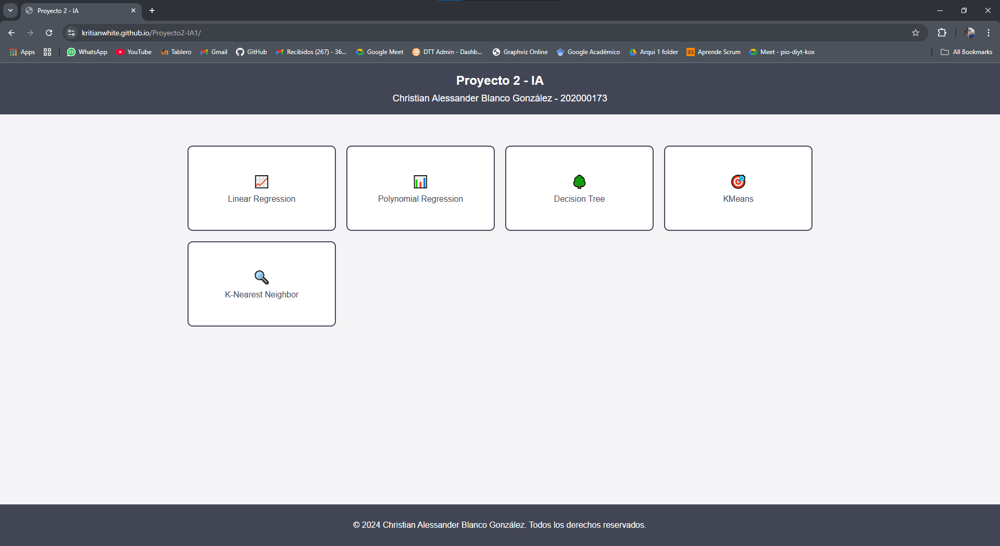

---

## Uso de la Regresión Lineal

### Descripción
La página de **Regresión Lineal** permite cargar un archivo CSV con datos, entrenar un modelo de regresión lineal y visualizar una gráfica que muestra la línea de mejor ajuste.

### Instrucciones de Uso
1. **Carga de Datos**:
   - Haz clic en el botón "Seleccionar archivo" y selecciona un archivo CSV en tu dispositivo. El archivo debe contener datos con dos columnas numéricas sin encabezados.
   
   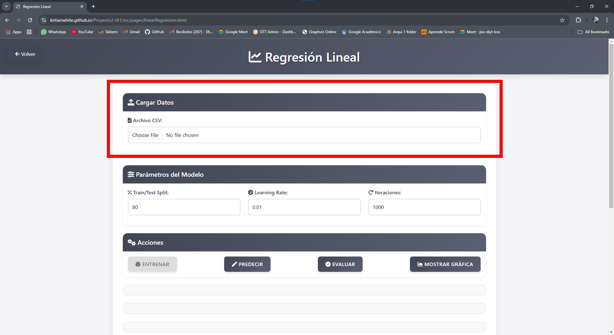

2. **Entrenar el Modelo**:
   - Una vez cargado el archivo, el sistema entrenará automáticamente el modelo. La página calculará la línea de regresión para los puntos de datos.

3. **Visualización de la Gráfica**:
   - La gráfica se genera automáticamente, mostrando los puntos de datos en un plano y una línea de mejor ajuste.
   - La gráfica permite ver la relación lineal entre las variables y la predicción de valores futuros.

   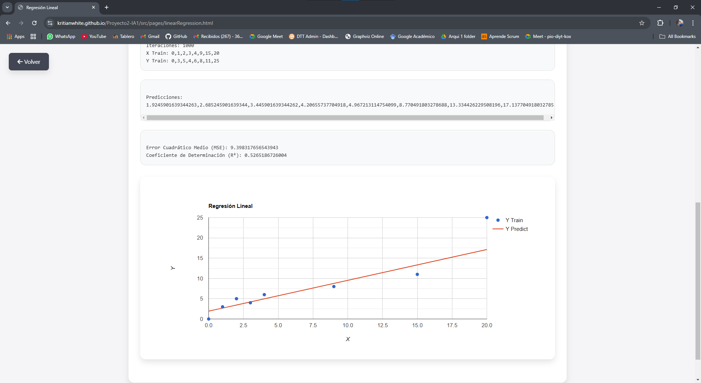

---

## Uso de la Regresión Polinomial

### Descripción
La página de **Regresión Polinomial** permite ajustar los datos a una función polinomial y visualizar la curva de ajuste en una gráfica.

### Instrucciones de Uso
1. **Carga de Datos**:
   - Haz clic en "Seleccionar archivo" para cargar un archivo CSV que contenga dos columnas numéricas con los datos a analizar.

2. **Entrenar el Modelo**:
   - Al cargar el archivo, el modelo entrenará automáticamente usando los datos cargados y ajustará una curva polinomial.

3. **Visualización de la Gráfica**:
   - La gráfica muestra los puntos de datos y la curva polinomial ajustada que mejor representa la relación entre los datos.
   - Puedes observar cómo la curva se ajusta a los puntos, capturando relaciones no lineales entre las variables.

   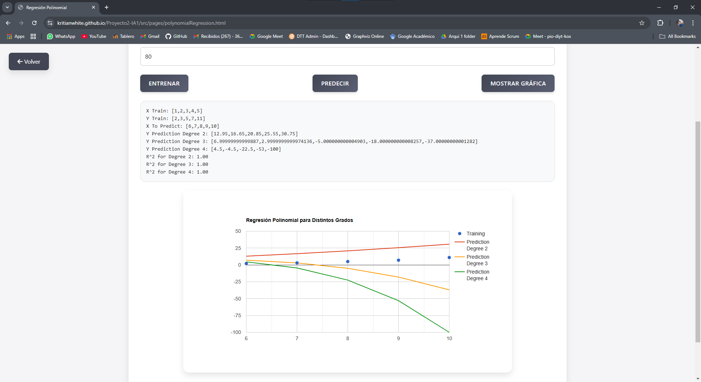

---

## Uso del Árbol de Decisión ID3

### Descripción
La página de **Árbol de Decisión ID3** permite cargar un archivo JSON con datos estructurados, construir un árbol de decisión y visualizarlo de forma gráfica.

### Instrucciones de Uso
1. **Carga de Datos**:
   - Haz clic en el botón "Seleccionar archivo" y carga un archivo en formato JSON que contenga datos estructurados (las variables deben estar etiquetadas en el archivo).
   
   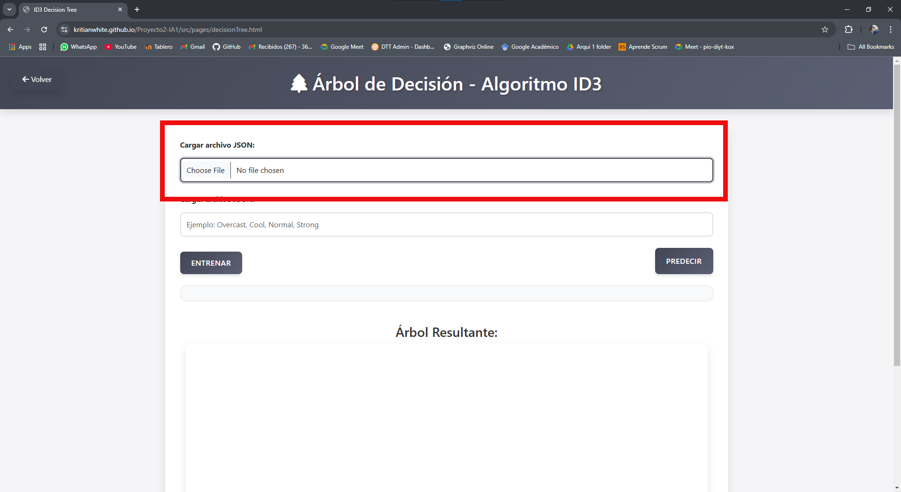

2. **Entrenar el Modelo**:
   - Al cargar el archivo JSON, el modelo construirá el árbol de decisión.
   
3. **Visualización del Árbol**:
   - El árbol de decisión se muestra en un gráfico de nodos y ramas, donde cada nodo representa una decisión basada en una variable, y las ramas indican los resultados posibles.
   - Puedes explorar el árbol para entender el flujo de decisiones que el modelo toma para clasificar nuevos datos.

   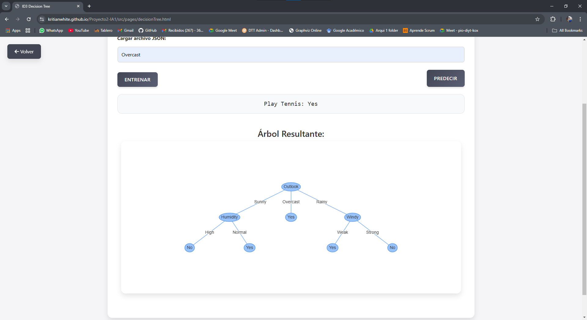

---

## Uso del Modelo KMeans

### Descripción
La página de **KMeans** permite realizar agrupamiento de datos en varios clusters. Es útil para segmentar los datos en grupos basados en similitudes.

### Instrucciones de Uso
1. **Carga de Datos y Configuración de Parámetros**:
   - Carga un archivo CSV con datos de dos columnas numéricas.
   - Selecciona el número de clusters en el campo de configuración y define el número de iteraciones.

   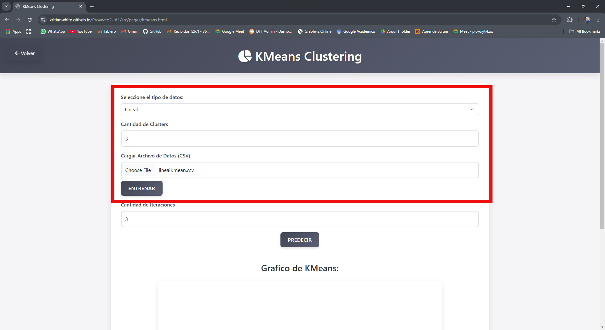

2. **Entrenar el Modelo**:
   - Al cargar el archivo y configurar los parámetros, el modelo agrupará los datos en los clusters definidos.

3. **Visualización de Clusters**:
   - Los puntos de datos se muestran en un gráfico con colores diferentes para cada cluster. El centro de cada cluster está marcado.
   - La gráfica permite visualizar la distribución y agrupación de los datos según su similitud.

   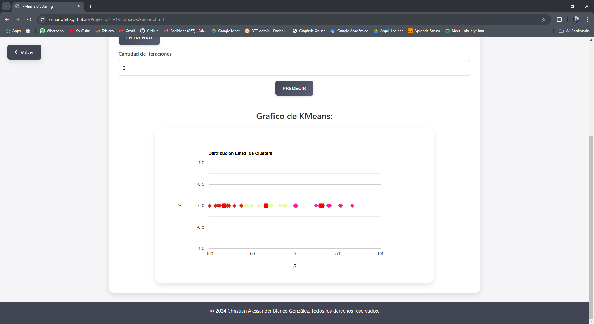

---

## Uso del Modelo K-Nearest Neighbor (KNN)

### Descripción
La página **KNN** permite clasificar puntos en función de su proximidad a otros puntos dentro del conjunto de datos. Es útil para análisis de similitudes y clasificación.

### Instrucciones de Uso
1. **Carga de Datos**:
   - Haz clic en "Seleccionar archivo" y selecciona un archivo JSON con datos estructurados.
   
    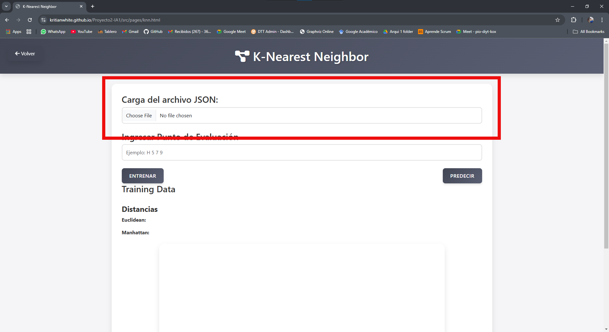

2. **Definir el Punto de Evaluación**:
   - Introduce manualmente las coordenadas o características del punto que deseas clasificar en el campo de entrada de evaluación.
   
   **[Agregar imagen]**: Resaltar el campo de entrada donde el usuario puede especificar el punto a clasificar.

3. **Clasificación del Punto**:
   - Al ingresar las características del punto, el modelo KNN calculará la distancia entre el punto dado y los puntos del conjunto de datos. Se clasifica el punto según el grupo mayoritario entre los vecinos más cercanos.
   - La página muestra el grupo o categoría asignada al nuevo punto.

   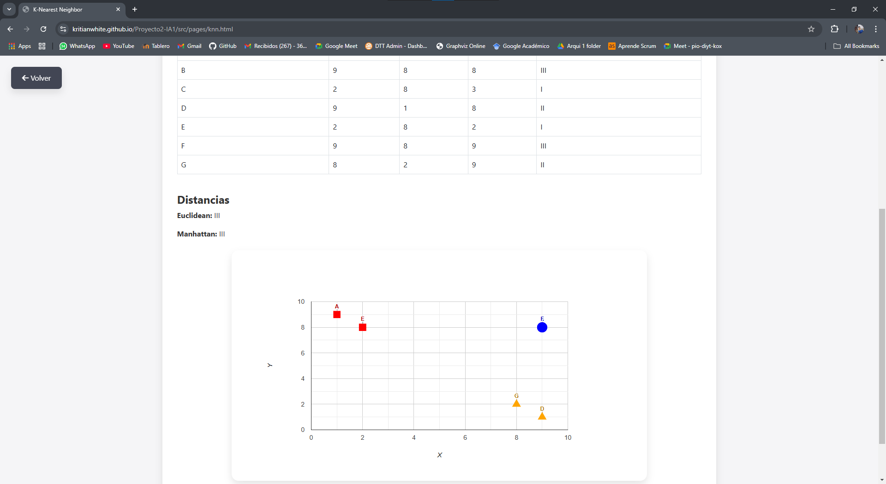

---

## Consideraciones Generales

1. **Formato de Datos**:
   - Asegúrarse de que los archivos CSV tengan exactamente dos columnas numéricas para modelos de regresión y clustering.
   - Los archivos JSON deben estar estructurados con etiquetas claras para cada variable.

2. **Navegación**:
   - Puedes regresar a la **Página de Inicio** en cualquier momento haciendo clic en el botón de regreso que aparece en cada página de modelo.
   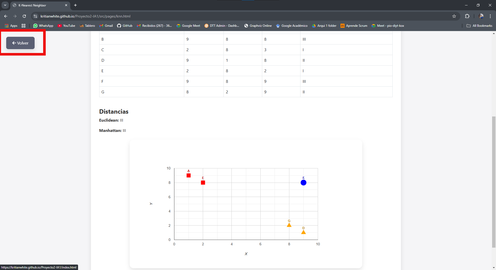

3. **Mensajes de Error**:
   - Si los datos cargados no tienen el formato correcto, el sistema mostrará un mensaje de error y solicitará que cargues un archivo compatible.
    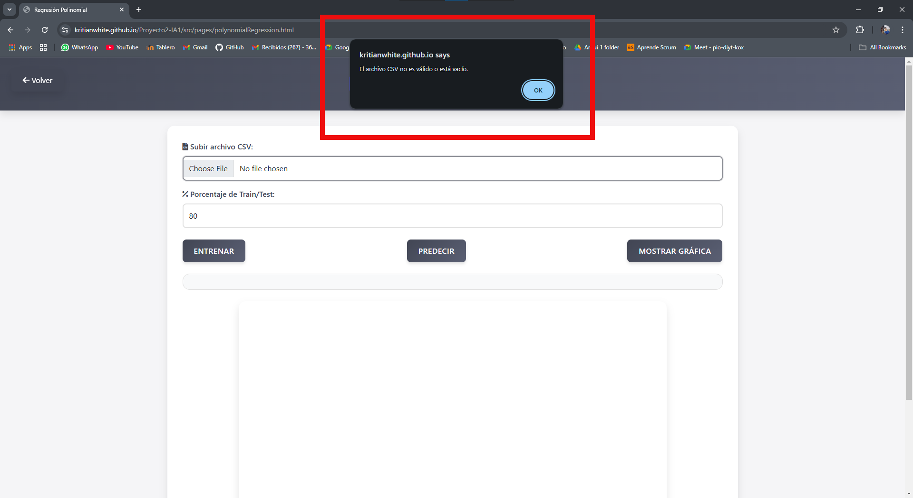

